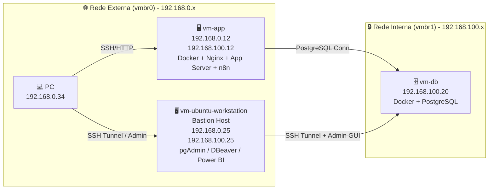
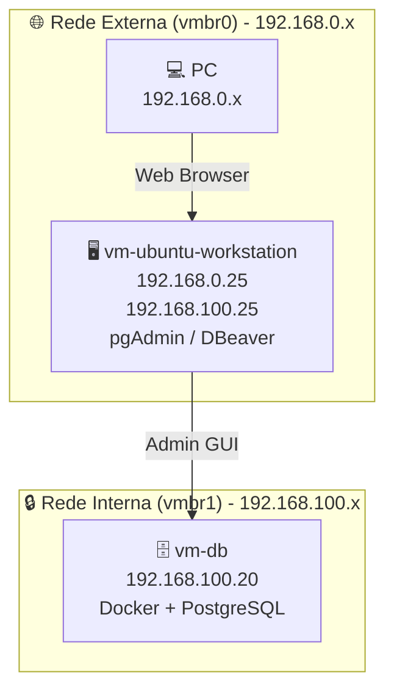

# Mini Datacenter Documentation

## 🎯 Objetivo
Documentar a criação de um mini datacenter em laboratório, simulando práticas de produção com separação entre aplicação, banco de dados e workstation administrativa.

---
## 🖥️ Infraestrutura de Virtualização

    Proxmox VE: versão 9.2.2 (pve-lab).

    Todas as VMs rodam Ubuntu 24.04 LTS (Noble).


    
## 🏗️ Componentes

### vm-app
- **Função:** Servidor de aplicação e backend.  
- **Sistema:** Ubuntu 24.04 LTS (Noble).  
- **IP externo:** 192.168.0.12/24 via `ens18` (vmbr0).  
- **IP interno:** 192.168.100.12/24 via `ens19` (vmbr1).  
- **Interfaces:** `ens18` (MTU 1400) e `ens19` (MTU 1400).  
- **Serviços:** Docker Engine, Nginx (em Docker), aplicação backend, containers e redes Docker.  
- **Papel:** Receber tráfego do PC e acessar o banco via rede interna, sem atuar como bastion host para administração do banco.  

---

### vm-db
- **Função:** Servidor de banco de dados.  
- **Sistema:** Ubuntu 24.04 LTS (Noble).  
- **IP interno:** 192.168.100.20/24 via `ens18` (vmbr1).  
- **Interfaces:** `ens18` (MTU 1500) na rede interna.  
- **Serviços:** Docker Engine, PostgreSQL (em Docker).  

---

### vm-ubuntu-workstation
- **Função:** Bastion Host; Administração PostgreSQL; Encaminhamento SSH Tunnel.  
- **Sistema:** Ubuntu 24.04 LTS (Noble).  
- **IP externo:** 192.168.0.25/24 via `ens18` (vmbr0).  
- **IP interno:** 192.168.100.25/24 via `ens19` (vmbr1).  
- **Interfaces:** `ens18` (MTU 1400) e `ens19` (MTU 1500).  
- **Serviços:** OpenSSH Server; pgAdmin4 Web.  
- **Observação:** DBeaver e Power BI são executados no PC local (192.168.0.34) e não na workstation.  

---

## 🌐 Redes
- **vmbr0 (externa):** rede 192.168.0.0/24, conectando o host físico e permitindo acesso do PC às VMs pela interface `ens18` da workstation e do `vm-app`.  
- **vmbr1 (interna):** rede privada 192.168.100.0/24, entre vm-app, vm-db e vm-workstation; o `vm-db` usa somente esta rede pela interface `ens18`, e a workstation usa `ens19` para a mesma faixa interna.  

---

## 🔄 Fluxo de acesso
- PC (192.168.0.34) → vm-app (192.168.0.12) → via SSH/HTTP/n8n
- vm-app (192.168.100.12) → vm-db (192.168.100.20) → via PostgreSQL da rede interna
- PC (192.168.0.34) → vm-ubuntu-workstation (192.168.0.25) → via SSH/Tunnel
- vm-ubuntu-workstation (192.168.100.25) → vm-db (192.168.100.20) → via PostgreSQL administrado por DBeaver/pgAdmin/Power BI

---

## 📊 Diagramas da Arquitetura

### Geral

✅ Resultado esperado

    vm-app com IPs estáticos 192.168.0.12 (externo) e 192.168.100.12 (interno).

    vm-ubuntu-workstation atua como bastion host para acesso administrativo ao PostgreSQL.

    Documentação e diagramas consistentes com a nova arquitetura.

    Netplan atualizado com routes em vez de gateway4.

    Fluxo principal de administração: PC → bastion workstation → vm-db.
    Fluxo de aplicação: PC → vm-app → vm-db.

    n8n acessível em http://192.168.0.12:5678.

---

Isolado da vm-ubuntu-workstation:
 


---

## 🔐 Configuração do PostgreSQL no DBeaver e no Power BI

A arquitetura de acesso segue o padrão do bastion host documentado em [config-dbeaver-sshtunnel-bastion.md](config-dbeaver-sshtunnel-bastion.md): o cliente nunca conecta diretamente ao PostgreSQL da rede interna. Em vez disso, ele abre um túnel SSH pela `vm-ubuntu-workstation` e conecta ao banco por `localhost` ou pela porta local encaminhada.

### 1) DBeaver Community 26.2.1.202609210342

1. Abra o DBeaver e clique em `Database > New Database Connection`.
2. Selecione `PostgreSQL`.
3. Na aba `Main`, configure:
   - `Host`: `localhost` ou `127.0.0.1`
   - `Port`: `5432` (ou a porta local forwarding que você definiu)
   - `Database`: `postgres` ou o banco alvo
   - `Username`: usuário do PostgreSQL, por exemplo `devops` ou `postgres`
   - `Password`: senha do usuário
4. Na aba `SSH`, ative `Use SSH Tunnel`.
5. Preencha:
   - `SSH Host`: `192.168.0.25`
   - `SSH Port`: `22`
   - `SSH User`: `golbery` (ou o usuário administrativo configurado na workstation)
   - `Authentication`: `Password` ou `Public Key`
   - Se usar chave, selecione a chave privada correspondente (`id_ed25519` ou outra já validada no host)
6. Clique em `Test Connection`.
7. Se tudo estiver correto, o DBeaver estabelece o SSH na workstation e encaminha a conexão para `192.168.100.20:5432` no backend do PostgreSQL.

Importante:
- O PostgreSQL não deve ser exposto diretamente na rede externa.
- No DBeaver, o banco aparece como localhost porque o túnel SSH já faz o encaminhamento local.
- A conexão real no backend continua sendo `192.168.100.20:5432`, acessível somente pela `vm-ubuntu-workstation`.

Exemplo de fluxo:
- PC local → DBeaver → SSH Tunnel → `vm-ubuntu-workstation` (192.168.0.25) → `vm-db` (192.168.100.20:5432)

### 2) Power BI Desktop 2.156.951.0 64-bit (julho de 2026)

O Power BI Desktop não cria um SSH Tunnel dentro da conexão PostgreSQL como o DBeaver. Para manter o padrão seguro do bastion host, o túnel precisa ser aberto na máquina local antes de iniciar a conexão.

#### Passo 1 — Abrir o túnel SSH na máquina local
No terminal do PC, execute:

```bash
ssh -L 5433:192.168.100.20:5432 golbery@192.168.0.25
```

Esse comando cria um encaminhamento local tal que:
- `localhost:5433` no PC aponta para `192.168.100.20:5432` na rede interna, passado pela workstation do bastion.

#### Passo 2 — Configurar o Power BI
1. Abra o Power BI Desktop.
2. Clique em `Obter Dados`.
3. Selecione `Banco de Dados PostgreSQL`.
4. Preencha:
   - `Servidor`: `localhost`
   - `Base de Dados`: `postgres` ou o banco desejado
   - `Porta`: `5433`
   - `Modo de conexão`: `Importar` ou `Consulta Direta` conforme o objetivo
5. Informe usuário e senha do PostgreSQL.
6. Clique em `Conectar`.
7. Se a conexão funcionar, o Power BI passa a consultar o banco pela porta local encaminhada.

Observações importantes:
- O Power BI não usa a mesma UI de SSH do DBeaver; o túnel precisa existir antes da conexão.
- Em geral, a prática mais segura é usar `localhost:5433` para representar o acesso via bastion, evitando qualquer exposição direta do PostgreSQL na rede externa.
- Para ambientes de produção, manter o banco isolado e confiar o acesso ao SSH do bastion evita a abertura de portas no PostgreSQL.

### 3) Recomendação operacional

Para manter o ambiente consistente e seguro, a convenção ideal é:
- `vm-db`: PostgreSQL em `192.168.100.20`
- `vm-ubuntu-workstation`: bastion em `192.168.0.25` / `192.168.100.25`
- DBeaver: usa `SSH Tunnel` diretamente dentro da conexão
- Power BI: usa `ssh -L` no cliente local antes da conexão

Essa abordagem preserva o isolamento da rede privada, mantém o banco inacessível diretamente da internet ou da rede externa e permite acesso seguro para administração e análise.

---
## Documentação Relacionada

- [config-dbeaver-sshtunnel-bastion.md](config-dbeaver-sshtunnel-bastion.md)

---
## 📌 Próximos passos

    Configurar backend na vm-app para usar PostgreSQL.

    Criar tabelas e dados de teste.

    Documentar expansão futura (Redis, API Gateway, serviços adicionais).

    Diagramar serviços futuros como vox-pix-api, n8n e JavaHelper_AI.