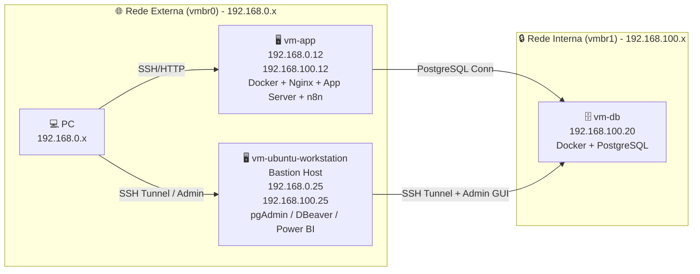

# Mini Datacenter Plan

## 🎯 Objetivo
Criar um ambiente de laboratório que simule um datacenter em nuvem, com separação clara entre aplicação, banco de dados e workstation administrativa, utilizando VMs, redes internas e containers Docker.

---

## 🖥️ Infraestrutura de Virtualização
- **Proxmox VE:** versão 9.2.2 (pve-lab).  
- Todas as VMs rodam **Ubuntu 24.04 LTS (Noble)**.  

---

## 🏗️ Componentes

### vm-app
- **Função:** Servidor de aplicação e backend.  
- **Sistema:** Ubuntu 24.04 LTS (Noble).  
- **IP externo:** 192.168.0.12/24 via `ens18` (vmbr0).  
- **IP interno:** 192.168.100.12/24 via `ens19` (vmbr1).  
- **Interfaces:** `ens18` (MTU 1400) e `ens19` (MTU 1400).  
- **Serviços:** Docker Engine, Nginx, aplicação backend, n8n, redes Docker.  
- **Papel:** Receber tráfego do PC e acessar o banco via rede interna, sem atuar como bastion host para administração do PostgreSQL.  

---

### vm-db
- **Função:** Servidor de banco de dados.  
- **Sistema:** Ubuntu 24.04 LTS (Noble).  
- **IP interno:** 192.168.100.20/24 via `ens18` (vmbr1).  
- **Interfaces:** `ens18` (MTU 1500) na rede interna.  
- **Serviços:** Docker Engine, PostgreSQL.  
- **Papel:** Armazenamento seguro de dados, acessível apenas pela vm-app e workstation.  

---

### vm-ubuntu-workstation
- **Função:** Workstation administrativa e Bastion Host.  
- **Sistema:** Ubuntu 24.04 LTS (Noble).  
- **IP externo:** 192.168.0.25/24 via `ens18` (vmbr0).  
- **IP interno:** 192.168.100.25/24 via `ens19` (vmbr1).  
- **Interfaces:** `ens18` (MTU 1400) e `ens19` (MTU 1500).  
- **Serviços:** OpenSSH Server; pgAdmin4 Web.  
- **Papel:** Bastion Host, administração PostgreSQL e encaminhamento SSH Tunnel.  

---

## 🌐 Redes
- **vmbr0 (externa):** rede 192.168.0.0/24, conectando o host físico e permitindo acesso do PC às VMs pela interface `ens18` da workstation e do `vm-app`.  
- **vmbr1 (interna):** rede privada 192.168.100.0/24, entre vm-app, vm-db e vm-workstation; o `vm-db` usa somente esta rede via `ens18`, e a workstation usa `ens19` para a mesma faixa interna.  

---

## 🔄 Fluxo de acesso
- **PC → vm-app (externa)** → via SSH/HTTP/n8n.  
- **vm-app → vm-db (interna)** → via PostgreSQL da rede interna.  
- **PC → vm-ubuntu-workstation (externa)** → via SSH/Tunnel para administração segura.  
- **vm-ubuntu-workstation → vm-db (interna)** → via pgAdmin, DBeaver, Power BI e SSH Tunnel.  

---

## 📊 Diagramas da Arquitetura

### Geral

 
Isolado da vm-ubuntu-workstation:
 
```mermaid
flowchart TB
    PC["💻 PC\n192.168.0.34"] -->|SSH Tunnel (ED25519)| VMWS["🖥️ vm-ubuntu-workstation\nBastion Host\n192.168.0.25\n192.168.100.25\npgAdmin4 Web"]
    VMWS -->|Admin GUI| VMDB["🗄️ vm-db\n192.168.100.20\nDocker + PostgreSQL"]

    subgraph External_Network ["🌐 Rede Externa (vmbr0) - 192.168.0.x"]
        PC
        VMWS
    end

    subgraph Internal_Network ["🔒 Rede Interna (vmbr1) - 192.168.100.x"]
        VMWS
        VMDB
    end
```

---

## Sprint 04 — Administração PostgreSQL

Status: ✅ CONCLUÍDA

Entregas:
- PostgreSQL operacional
- pgAdmin operacional
- DBeaver operacional
- Bastion Host operacional
- SSH Tunnel operacional
- n8n operacional
- Documentação operacional criada

---

## 📌 Checklist dos próximos passos

### Banco de Dados

- [x] Instalar Docker na vm-db.
- [x] Subir container PostgreSQL na vm-db.
- [x] Configurar PostgreSQL.
- [x] Criar bancos e tabelas.
- [x] Criar banco de dados, tabelas e dados de teste no PostgreSQL.

### Administração de Banco

- [x] Instalar pgAdmin4 Web.
- [x] Configurar pgAdmin via Bastion Host.
- [x] Instalar DBeaver no PC físico (192.168.0.34).
- [x] Configurar Bastion Host.
- [x] Configurar SSH Tunnel.
- [x] Configurar conexão DBeaver → PostgreSQL.
- [x] Documentar arquitetura Bastion Host + SSH Tunnel.
- [x] Criar documentação operacional do DBeaver com SSH Tunnel.
- [x] Documentar credenciais, portas e estratégias de acesso ao banco.
- [x] Documentar acesso do Power BI Desktop via túnel local (`ssh -L`).


### Aplicação

- [x] Configurar vm-app para se conectar ao PostgreSQL.
- [x] Instalar n8n na vm-app.
- [ ] Configurar variáveis de ambiente da aplicação.
- [ ] Criar usuários específicos do PostgreSQL para cada aplicação.
- [ ] Implementar segregação de acessos por banco/schema.


### Segurança

- [ ] Configurar UFW na vm-app.
- [ ] Configurar UFW na vm-db.
- [ ] Configurar UFW na vm-ubuntu-workstation.
- [ ] Configurar fail2ban na vm-app.
- [ ] Configurar fail2ban na vm-db.
- [ ] Configurar fail2ban na vm-ubuntu-workstation.
- [ ] Restringir acesso ao PostgreSQL apenas para hosts autorizados da rede interna.
- [ ] Revisar exposição de portas Docker.


### Backup e Recuperação

- [ ] Configurar backups automáticos do PostgreSQL.
- [ ] Configurar retenção de backups.
- [ ] Documentar procedimento de restauração.
- [ ] Configurar snapshots periódicos das VMs.
- [ ] Testar restauração completa do banco.


### Monitoramento

- [ ] Instalar Netdata na vm-app.
- [ ] Instalar Netdata na vm-db.
- [ ] Instalar Netdata na vm-ubuntu-workstation.
- [ ] Criar dashboard centralizado de monitoramento.
- [ ] Documentar métricas críticas.


---
