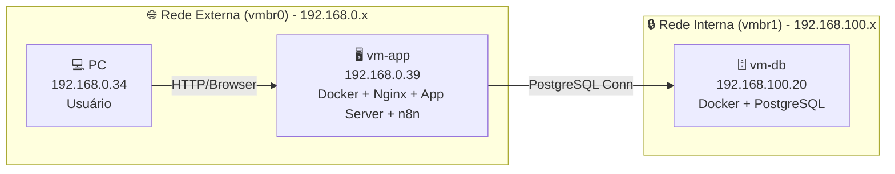

# Plano de Instalação do n8n em Cenário de Laboratório Profissional

📄 Checklist — Instalação do n8n na vm-app
markdown

# Checklist — Instalação do n8n na vm-app

## 🎯 Objetivo
Rodar o n8n em container Docker na vm-app, acessível pelo PC (192.168.0.34 → vm-app), utilizando o PostgreSQL da vm-db como banco de dados.

---

## 🛠️ Pré-requisitos
- vm-app rodando Ubuntu 24.04 LTS (Noble).  
- Docker Engine instalado e funcionando.  
- vm-db com PostgreSQL ativo e acessível pela rede interna (vmbr1).  

---

## 📂 Criar diretório para configuração
```bash
sudo mkdir -p /opt/n8n
sudo chown $USER:$USER /opt/n8n

🔧 Arquivo .env para credenciais

Crie /opt/n8n/.env com:
Code

DB_TYPE=postgresdb
DB_POSTGRESDB_HOST=192.168.100.20
DB_POSTGRESDB_PORT=5432
DB_POSTGRESDB_DATABASE=appdb
DB_POSTGRESDB_USER=devops
DB_POSTGRESDB_PASSWORD=senha123

N8N_PORT=5678
N8N_HOST=0.0.0.0

🚀 Rodar container n8n
bash

docker run -d \
  --name n8n \
  -p 5678:5678 \
  -v n8n_data:/home/node/.n8n \
  --env-file /opt/n8n/.env \
  n8nio/n8n

🌐 Acesso

    Navegador no PC → http://192.168.0.39:5678

    n8n conectado ao PostgreSQL da vm-db.

🔒 Segurança

    Configurar firewall UFW na vm-app para expor apenas porta 5678.

    Não expor PostgreSQL na rede externa.

    Usar volumes para persistência (n8n_data).

📌 Próximos passos

    Configurar SSL/TLS para acesso seguro.

    Automatizar backup dos workflows.

    Monitorar consumo de recursos na vm-app.

## 1. Preparação do Ambiente
- **VMs configuradas**:  
  - vm-app: aplicação, Docker + Nginx.  
  - vm-db: banco de dados PostgreSQL em container.  
- **Rede interna (vmbr1)** para comunicação segura entre app ↔ db.  
- **Rede externa (vmbr0)** para acesso do usuário via proxy reverso.

---

## 2. Instalação do n8n
- Criar rede Docker dedicada (`n8n-net`).
- Configurar `docker-compose.yml` com variáveis de ambiente seguras via `.env`.
- Usar volumes persistentes para `/home/node/.n8n` e logs.
- Proxy reverso com Nginx + HTTPS (certificado interno ou Let's Encrypt).

---

## 3. Monitoramento com Prometheus e Grafana

### 3.1 Exporters
- **Node Exporter**: coleta métricas da VM (CPU, memória, disco).
- **cAdvisor**: coleta métricas de containers Docker.
- **Postgres Exporter**: coleta métricas do banco de dados.

### 3.2 Configuração Prometheus
- Adicionar targets para:
  - n8n container (via métricas expostas em `/metrics`).
  - cAdvisor e Node Exporter.
  - PostgreSQL Exporter.
- Configurar regras de alerta (Alertmanager):
  - Alta latência em workflows.
  - Falha de conexão com banco.
  - Uso excessivo de CPU/memória.

### 3.3 Configuração Grafana
- Criar dashboards:
  - **n8n Workflows**: tempo de execução, falhas, filas.
  - **Infraestrutura**: CPU, memória, disco da VM.
  - **Banco de Dados**: conexões ativas, tempo de resposta.
- Configurar alertas visuais e notificações (e-mail, Slack, Teams).

---

## 4. Estratégias de Backup e Recuperação

### 4.1 Backup do Banco de Dados
- Usar `pg_dump` ou `pgBackRest` para backups regulares.
- Armazenar backups em storage externo (NAS ou cloud).
- Rotina de backup:
  - **Diário**: incremental.
  - **Semanal**: completo.
  - **Mensal**: arquivamento.

### 4.2 Backup do n8n
- Backup dos volumes Docker (`/home/node/.n8n`).
- Backup dos arquivos de configuração (`docker-compose.yml`, `.env`, Nginx conf).

### 4.3 Testes de Recuperação
- Testar restauração em ambiente separado.
- Documentar procedimentos de recuperação:
  - Restaurar banco PostgreSQL.
  - Recriar containers n8n com volumes restaurados.
  - Validar workflows após restauração.

---

## 5. Segurança
- Variáveis de ambiente em `.env` com permissões restritas.
- Autenticação forte para acesso ao painel do n8n.
- Restringir acesso externo apenas via proxy reverso.
- TLS obrigatório para todas as conexões externas.

---

## 6. Escalabilidade
- Configurar n8n em modo cluster (se necessário).
- Balanceamento de carga com Nginx ou Traefik.
- Separar workers para execução de workflows pesados.
- Monitorar filas e ajustar recursos conforme demanda.

---

## 7. Manutenção Contínua
- Atualizações regulares do n8n e dependências.
- Revisão periódica de dashboards e alertas.
- Auditoria de segurança e permissões.
- Documentação atualizada de procedimentos.

---

## Conclusão
Este plano garante que o n8n seja instalado em laboratório profissional com práticas próximas de produção, cobrindo **segurança, monitoramento, backup e escalabilidade**.


🔧 Ajustes para um laboratório profissional

    Banco dedicado  
    Crie um banco exclusivo para o n8n, com usuário e senha fortes, e permissões mínimas necessárias. Isso evita que o n8n tenha acesso a outros schemas ou bancos.

    Rede Docker isolada  
    Use uma rede Docker própria para o n8n e conecte apenas os serviços necessários. Isso garante isolamento e facilita troubleshooting.

    Proxy reverso com HTTPS  
    Em laboratório profissional, mesmo que seja interno, configure certificados TLS (pode ser Let's Encrypt ou CA interna). Isso protege credenciais e webhooks.

    Volumes persistentes  
    Monte volumes para /home/node/.n8n e para logs. Assim, mesmo que o container seja recriado, você mantém dados e configurações.

    Backup e monitoramento  
    Configure backup automático do banco PostgreSQL e monitore o container n8n com ferramentas como Prometheus + Grafana ou até mesmo alertas via webhook.

🛡️ Segurança adicional

    Configure variáveis de ambiente em um arquivo .env e não diretamente no docker-compose.yml.

    Restrinja o acesso externo ao n8n apenas via proxy (não exponha a porta 5678 diretamente).

    Use autenticação básica ou OAuth para proteger o painel do n8n.
    
    
Golbery, perfeito 👌 — aqui está o **diagrama Mermaid específico do n8n**, mostrando o fluxo de acesso do seu PC → vm-app → vm-db. Assim você terá a visão clara de como o n8n se encaixa na arquitetura do mini datacenter.

---

## 📊 Diagrama da Arquitetura com n8n



---

### ✅ O que esse diagrama mostra
- O **PC (192.168.0.34)** acessa o **n8n** rodando em container na **vm-app (192.168.0.39)** via navegador.  
- O **n8n** usa o **PostgreSQL** hospedado na **vm-db (192.168.100.20)** pela rede interna (`vmbr1`).  
- A **vm-app** continua atuando como bastion host e servidor de aplicação.  
- O banco de dados permanece isolado, acessível apenas pela rede interna.  

---

## 📝 Prompt para novo chat dedicado ao n8n

Você pode abrir um novo chat e colar este prompt para focar exclusivamente na instalação e configuração do n8n:

```
Quero instalar o n8n na vm-app do meu mini datacenter.  
- Sistema: Ubuntu 24.04 LTS (Noble).  
- Infraestrutura: Proxmox VE 9.2.2 (pve-lab).  
- vm-app: IP externo 192.168.0.39, interno 192.168.100.10.  
- vm-db: PostgreSQL rodando em 192.168.100.20.  
- PC: 192.168.0.34 acessa a vm-app via navegador.  

Preciso de um passo a passo completo para rodar o n8n em container Docker na vm-app, usando o PostgreSQL da vm-db como banco de dados, com boas práticas de segurança, persistência, backup e monitoramento.
```

---
