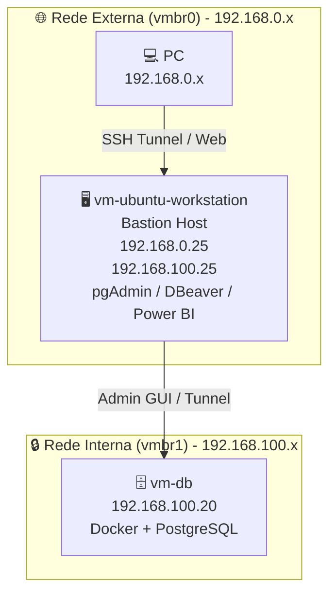

# Documentação — vm-ubuntu-workstation

## 🎯 Objetivo
Registrar a configuração e o papel da **vm-ubuntu-workstation** no mini datacenter, atuando como estação administrativa e como bastion host para acesso seguro ao PostgreSQL e demais serviços internos.

---

## 🖥️ Sistema
- **Sistema Operacional:** Ubuntu 24.04 LTS (Noble).  
- **Infraestrutura:** Proxmox VE 9.2.2 (pve-lab).  
- **Função:** administração, suporte ao desenvolvimento e entrada segura para acesso ao ambiente interno.  

---

## 🌐 Rede
- **Interface externa:** `ens18`  
- **MTU externa:** 1400  
- **IP externo (vmbr0):** 192.168.0.25/24  
- **Interface interna:** `ens19`  
- **MTU interna:** 1500  
- **IP interno (vmbr1):** 192.168.100.25/24  
- **IPv6:**  
  - Link-local externo: `fe80::be24:11ff:fe73:c47a/64`  
  - Link-local interno: `fe80::be24:11ff:fe0e:833a/64`  

---

## 🔧 Serviços
- **Ferramentas de administração:**  
  - pgAdmin  
  - DBeaver Community  
  - Power BI Desktop (via túnel SSH local)  
- **Função principal:** atuar como bastion host para acesso seguro ao PostgreSQL da `vm-db` pela rede interna.  
- **Acesso administrativo:** via SSH Tunnel, sem expor o PostgreSQL diretamente na rede externa.  

---

## 📊 Diagrama isolado da vm-ubuntu-workstation


---

## ✅ Resultado esperado

- a workstation fica acessível pela rede externa (`vmbr0`);
- a workstation atua como bastion host para administração do ambiente interno;
- o PostgreSQL da `vm-db` não fica exposto diretamente na rede externa;
- ferramentas gráficas e usuários administrativos acessam o banco pela rede interna via SSH Tunnel.

---

## 🔐 Bastion host e acesso ao PostgreSQL

A `vm-ubuntu-workstation` é o ponto de entrada administrativo para o banco de dados da `vm-db`.

### Fluxo seguro recomendado

```text
PC local
  ↓
SSH Tunnel ou acesso via bastion
  ↓
vm-ubuntu-workstation (192.168.0.25 / 192.168.100.25)
  ↓
vm-db (192.168.100.20:5432)
```

### Operação típica
- DBeaver: usa `SSH Tunnel` diretamente na conexão ao PostgreSQL;
- Power BI Desktop: usa `ssh -L` no cliente local antes de conectar;
- pgAdmin: deve conectar ao banco via endereço da rede interna ou via túnel local apropriado;
- nenhuma porta do PostgreSQL deve ficar aberta diretamente na rede externa.

---

## 📌 Configuração recomendada

### 1. Redes e interfaces
- Rede externa: `192.168.0.25/24` em `ens18`
- Rede interna: `192.168.100.25/24` em `ens19`

### 2. SSH para bastion
Habilite o SSH na workstation e configure autenticação por chave para acesso seguro:

```bash
sudo systemctl enable --now ssh
ssh-keygen -t ed25519 -C "admin@workstation"
```

### 3. Conexão ao PostgreSQL
- Host do PostgreSQL: `192.168.100.20`
- Porta: `5432`
- Acesso real: somente pela rede interna e via bastion host

### 4. Ferramentas de administração
- `pgAdmin`: acesso administrativo via workstation
- `DBeaver`: acesso via SSH Tunnel
- `Power BI Desktop`: acesso via `ssh -L 5433:192.168.100.20:5432 <user>@192.168.0.25`

---

## 📍 Resumo da arquitetura

A workstation centraliza o acesso administrativo e garante que o banco continue isolado na rede privada. Isso reduz a superfície de ataque, melhora a auditoria e mantém o ambiente mais próximo de um padrão de produção.

Aplicar:
```bash
sudo netplan apply
```

---

## 4. Testes de conectividade
- Do PC físico (`192.168.0.5`):
```bash
ping 192.168.0.25
```
- Da VM workstation:
```bash
ping 192.168.100.20
```

---

## 5. Instalação do pgAdmin
```bash
sudo apt update && sudo apt upgrade -y
sudo apt install pgadmin4 -y
sudo /usr/pgadmin4/bin/setup-web.sh
```

- Acesso via navegador: `http://192.168.0.25/pgadmin4`  
- Conexão ao banco:  
  - Host: `192.168.100.20`  
  - Porta: `5432`  
  - Usuário: `postgres`  
  - Senha: definida no container da `vm-db`  

---

## ✅ Resultado
- VM criada com **Ubuntu Server**.  
- IP fixo fora do range DHCP.  
- pgAdmin acessível via navegador do PC físico.  
- Comunicação segura com `vm-db` pela rede interna.  

---

# 📄 Checklist de Monitoramento — Ubuntu Server

### 📊 Recursos do sistema
- Instalar ferramentas de monitoramento:
  ```bash
  sudo apt install htop sysstat -y
  ```
- Usar:
  - `htop` → monitorar CPU, memória e processos em tempo real.  
  - `iostat` → verificar desempenho de disco.  
  - `free -h` → checar uso de memória.  

---

### 📜 Logs do sistema
- Verificar logs críticos:
  ```bash
  sudo journalctl -xe
  sudo tail -f /var/log/syslog
  ```
- Configurar rotação de logs com `logrotate` (já vem instalado por padrão).  

---

### 🛡️ Segurança e acessos
- Monitorar tentativas de login:
  ```bash
  sudo tail -f /var/log/auth.log
  ```
- Usar **fail2ban** para bloquear IPs suspeitos.  
- Revisar regras do firewall (`sudo ufw status`).  

---

### 📈 Serviços e rede
- Testar conectividade com a `vm-db`:
  ```bash
  ping 192.168.100.20
  ```
- Verificar portas abertas:
  ```bash
  sudo ss -tulwn
  ```
- Monitorar status do pgAdmin:
  ```bash
  sudo systemctl status apache2
  ```

---

### 🔔 Alertas e notificações
- Instalar **netdata** para monitoramento web em tempo real:
  ```bash
  sudo apt install netdata -y
  ```
- Configurar envio de alertas por e-mail (via `postfix` ou `msmtp`).  
- Integrar com Proxmox para alertas de uso de CPU/RAM.  

---

## ✅ Resultado
- Monitoramento ativo de CPU, memória, disco e rede.  
- Logs e acessos sob controle.  
- Alertas configurados para incidentes.  
- Ambiente seguro e pronto para produção.  

---


# 📄 Pacotes Extras Pós-Boot — Ubuntu Server

### 🛠️ Ferramentas básicas
```bash
sudo apt install net-tools htop curl wget git unzip -y
```
- `net-tools` → comandos de rede (`ifconfig`, `netstat`).  
- `htop` → monitoramento de CPU/memória.  
- `curl` e `wget` → downloads e testes HTTP.  
- `git` → controle de versão.  
- `unzip` → manipulação de arquivos compactados.  

---

### 🐘 pgAdmin
```bash
sudo apt install pgadmin4 -y
sudo /usr/pgadmin4/bin/setup-web.sh
```
- Acesse via navegador: `http://192.168.0.25/pgadmin4`.  
- Conecte ao PostgreSQL da `vm-db` pela rede interna.  

---

### 📈 Monitoramento web
```bash
sudo apt install netdata -y
```
- Interface web em `http://192.168.0.25:19999`.  
- Monitoramento em tempo real de CPU, memória, disco e rede.  

---

### 🔒 Segurança extra
```bash
sudo apt install fail2ban -y
```
- Protege contra tentativas de login SSH.  
- Configuração padrão já cobre ataques de força bruta.  

---

### 🛡️ Firewall UFW
```bash
sudo apt install ufw -y
sudo ufw allow ssh
sudo ufw allow http
sudo ufw allow https
sudo ufw enable
```

Para habilitar:
	sudo ufw enable.
Para desabilitar: 
	sudo ufw disable.

---

### 🗄️ Backup e snapshots
- Configurar snapshots regulares no Proxmox.  
- Usar `backup-hdd` para armazenar dumps da VM.  

---

## ✅ Resultado
- Ferramentas essenciais instaladas.  
- pgAdmin acessível via navegador.  
- Monitoramento ativo com Netdata.  
- Segurança reforçada com UFW e fail2ban.  
- Ambiente pronto para operação contínua e manutenção.  

---


