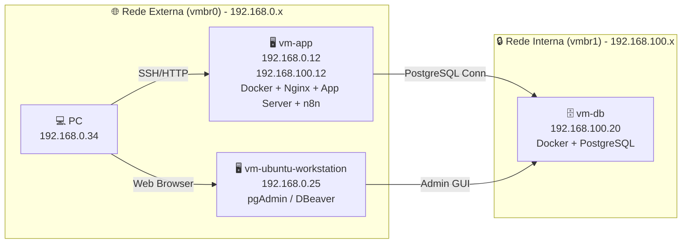
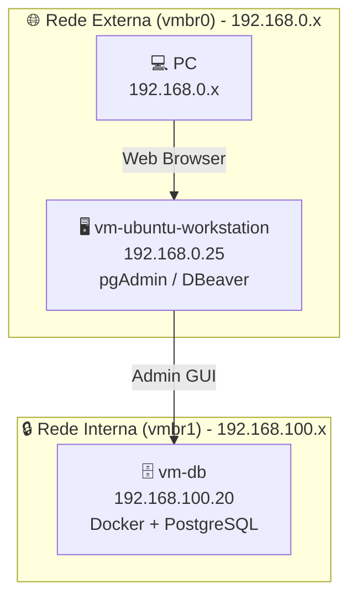

# Mini Datacenter Documentation

## 🎯 Objetivo
Documentar a criação de um mini datacenter em laboratório, simulando práticas de produção com separação entre aplicação, banco de dados e workstation administrativa.

---
## 🖥️ Infraestrutura de Virtualização

    Proxmox VE: versão 9.2.2 (pve-lab).

    Todas as VMs rodam Ubuntu 24.04 LTS (Noble).

    
## 🏗️ Componentes

### vm-app
- **Função:** Servidor de aplicação e bastion host.  
- **Sistema:** Ubuntu 24.04 LTS (Noble).  
- **IP externo:** 192.168.0.39 (vmbr0).  
- **IP interno:** 192.168.100.10 (vmbr1).  
- **Serviços:** Docker Engine, Nginx, aplicação backend.  

---

### vm-db
- **Função:** Servidor de banco de dados.  
- **Sistema:** Ubuntu 24.04 LTS (Noble).  
- **IP interno:** 192.168.100.20 (vmbr1).  
- **Serviços:** Docker Engine, PostgreSQL.  

---

### vm-ubuntu-workstation
- **Função:** Workstation administrativa.  
- **Sistema:** Ubuntu 24.04 LTS (Noble).  
- **IP externo:** 192.168.0.25 (vmbr0).  
- **Interface:** `ens18` com MTU 1400.  
- **Serviços:** pgAdmin, DBeaver, ferramentas de administração.  

---

## 🌐 Redes
- **vmbr0 (externa):** conecta o host físico e permite acesso do PC às VMs.  
- **vmbr1 (interna):** rede privada entre vm-app, vm-db e vm-workstation.  

---

## 🔄 Fluxo de acesso
- PC (192.168.0.34) → vm-app (192.168.0.12) → via SSH/HTTP/n8n
- vm-app (192.168.100.12) → vm-db (192.168.100.20) → via PostgreSQL
- vm-workstation (192.168.0.25) → vm-db (192.168.100.20) → via pgAdmin/DBeaver 

---

## 📊 Diagramas da Arquitetura

### Geral

✅ Resultado esperado

    vm-app com IPs estáticos 192.168.0.12 (externo) e 192.168.100.12 (interno).

    Documentação e diagramas consistentes.

    Netplan atualizado com routes em vez de gateway4.

    Fluxo de acesso preservado: PC → vm-app → vm-db.

    n8n acessível em http://192.168.0.12:5678.

---

Isolado da vm-ubuntu-workstation:
 

---

## 📌 Próximos passos

    Configurar backend na vm-app para usar PostgreSQL.

    Criar tabelas e dados de teste.

    Documentar expansão futura (Redis, API Gateway, serviços adicionais).

    Diagramar serviços futuros como vox-pix-api, n8n e JavaHelper_AI.