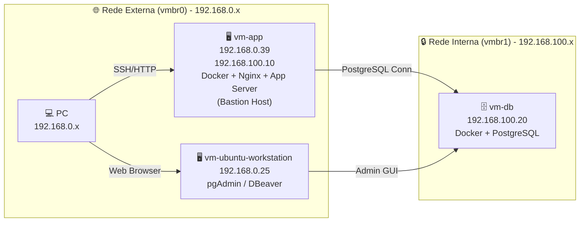

# Mini Datacenter Plan

## 🎯 Objetivo
Criar um ambiente de laboratório que simule um datacenter em nuvem, com separação clara entre aplicação, banco de dados e workstation administrativa, utilizando VMs, redes internas e containers Docker.

---

## 🖥️ Infraestrutura de Virtualização
- **Proxmox VE:** versão 9.2.2 (pve-lab).  
- Todas as VMs rodam **Ubuntu 24.04 LTS (Noble)**.  

---

## 🏗️ Componentes

### vm-app
- **Função:** Servidor de aplicação e bastion host.  
- **Sistema:** Ubuntu 24.04 LTS (Noble).  
- **IP externo:** 192.168.0.39 (vmbr0).  
- **IP interno:** 192.168.100.10 (vmbr1).  
- **Serviços:** Docker Engine, Nginx, aplicação backend.  
- **Papel:** Ponte entre rede externa e interna.  

---

### vm-db
- **Função:** Servidor de banco de dados.  
- **Sistema:** Ubuntu 24.04 LTS (Noble).  
- **IP interno:** 192.168.100.20 (vmbr1).  
- **Serviços:** Docker Engine, PostgreSQL.  
- **Papel:** Armazenamento seguro de dados, acessível apenas pela vm-app e workstation.  

---

### vm-ubuntu-workstation
- **Função:** Workstation administrativa.  
- **Sistema:** Ubuntu 24.04 LTS (Noble).  
- **IP externo:** 192.168.0.25 (vmbr0).  
- **Interface:** `ens18` com MTU 1400.  
- **Serviços:** pgAdmin, DBeaver, ferramentas de administração.  
- **Papel:** Administração gráfica do PostgreSQL e suporte ao desenvolvimento.  

---

## 🌐 Redes
- **vmbr0 (externa):** conecta o host físico e permite acesso do PC às VMs.  
- **vmbr1 (interna):** rede privada entre vm-app, vm-db e vm-workstation.  

---

## 🔄 Fluxo de acesso
- **PC → vm-app (externa)** → via SSH/HTTP.  
- **vm-app → vm-db (interna)** → via PostgreSQL.  
- **vm-workstation → vm-db (interna)** → via pgAdmin/DBeaver.  

---

## 📊 Diagramas da Arquitetura

### Geral

 
 
Isolado da vm-ubuntu-workstation
 
 ```mermaid
 flowchart TB
    PC["💻 PC\n192.168.0.x"] -->|Web Browser| VMWS["🖥️ vm-ubuntu-workstation\n192.168.0.25\npgAdmin / DBeaver"]
    VMWS -->|Admin GUI| VMDB["🗄️ vm-db\n192.168.100.20\nDocker + PostgreSQL"]

    subgraph External_Network ["🌐 Rede Externa (vmbr0) - 192.168.0.x"]
        PC
        VMWS
    end

    subgraph Internal_Network ["🔒 Rede Interna (vmbr1) - 192.168.100.x"]
        VMWS
        VMDB
    end
    ```
    
---

### 📌 Checklist dos próximos passos

    [x] Instalar Docker na vm-db.

    [x] Subir container PostgreSQL na vm-db.
    
    [x] Configurar usuário, senha e banco de dados no PostgreSQL.
    
    [x] Criar banco de dados, tabelas e dados de teste no PostgreSQL.
    
    [x] Instalar e configurar pgAdmin na vm-ubuntu-workstation.

    [ ] Configurar para gerenciar o banco de dados com pgAdmin considerando o fluxo: Meu PC (via pgAdmin browser) → vm-workstation → vm-db (interna).
    
    [ ] Instalar e configurar DBeaver na vm-ubuntu-workstation.
    
    [ ] Configurar para gerenciar o banco de dados com DBeaver considerando o fluxo: Meu PC (via DBeaver) → vm-workstation → vm-db (interna).
    
    [ ] Configurar variáveis de ambiente na vm-app para conexão com o PostgreSQL.
    
    [x] Configurar vm-app para se conectar ao PostgreSQL.

    [ ] Configurar firewall e regras de acesso entre vm-app e vm-db.

    [ ] Testar conexão da aplicação com o banco de dados.

    [ ] Configurar backups automáticos do PostgreSQL.

    [ ] Documentar credenciais e variáveis de ambiente para a aplicação.

    [ ] Configurar monitoramento com Netdata na vm-app e vm-db.

    [ ] Configurar fail2ban e UFW para segurança adicional.

    [ ] Criar scripts de inicialização para containers Docker na vm-app e vm-db.

    [ ] Documentar procedimentos de manutenção e atualização das VMs.

    [ ] Documentar expansão futura (Redis, API Gateway, etc.).

    [ ] Diagramar serviços futuros como vox-pix-api, n8n e JavaHelper_AI.