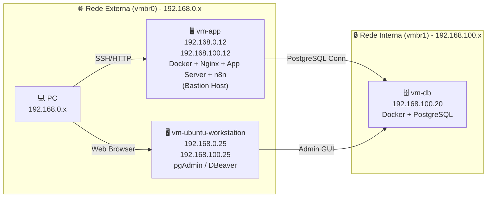
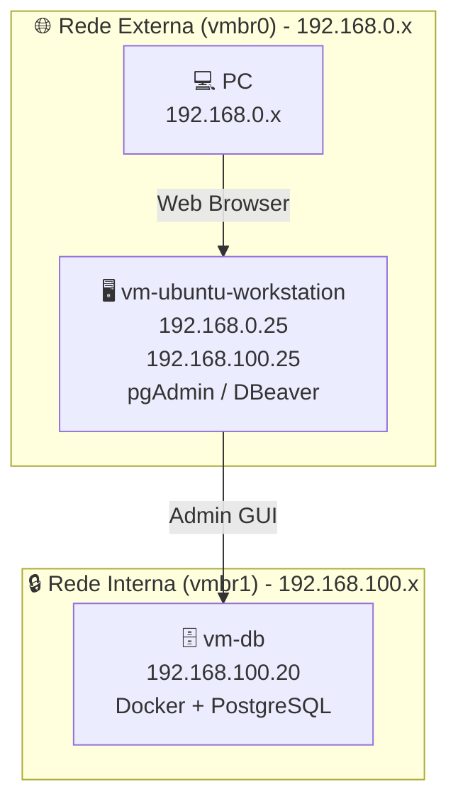

# Mini Datacenter Plan

## 🎯 Objetivo
Criar um ambiente de laboratório que simule um datacenter em nuvem, com separação clara entre aplicação, banco de dados e workstation administrativa, utilizando VMs, redes internas e containers Docker.

---

## 🖥️ Infraestrutura de Virtualização
- **Proxmox VE:** versão 9.2.2 (pve-lab).  
- Todas as VMs rodam **Ubuntu 24.04 LTS (Noble)**.  

---

## 🏗️ Componentes

### vm-app
- **Função:** Servidor de aplicação e bastion host.  
- **Sistema:** Ubuntu 24.04 LTS (Noble).  
- **IP externo:** 192.168.0.12 (vmbr0).  
- **IP interno:** 192.168.100.12 (vmbr1).  
- **Serviços:** Docker Engine, Nginx, aplicação backend, n8n.  
- **Papel:** Ponte entre rede externa e interna.  

---

### vm-db
- **Função:** Servidor de banco de dados.  
- **Sistema:** Ubuntu 24.04 LTS (Noble).  
- **IP interno:** 192.168.100.20 (vmbr1).  
- **Serviços:** Docker Engine, PostgreSQL.  
- **Papel:** Armazenamento seguro de dados, acessível apenas pela vm-app e workstation.  

---

### vm-ubuntu-workstation
- **Função:** Workstation administrativa.  
- **Sistema:** Ubuntu 24.04 LTS (Noble).  
- **IP externo:** 192.168.0.25/24 via `ens18` (vmbr0).  
- **IP interno:** 192.168.100.25/24 via `ens19` (vmbr1).  
- **Interfaces:** `ens18` (MTU 1400) e `ens19` (MTU 1500).  
- **Serviços:** pgAdmin, DBeaver, ferramentas de administração.  
- **Papel:** Administração gráfica do PostgreSQL, acesso à rede interna e suporte ao desenvolvimento.  

---

## 🌐 Redes
- **vmbr0 (externa):** rede 192.168.0.0/24, conectando o host físico e permitindo acesso do PC às VMs pela interface `ens18` da workstation.  
- **vmbr1 (interna):** rede privada 192.168.100.0/24, entre vm-app, vm-db e vm-workstation pela interface `ens19` da workstation.  

---

## 🔄 Fluxo de acesso
- **PC → vm-app (externa)** → via SSH/HTTP/n8n.  
- **vm-app → vm-db (interna)** → via PostgreSQL.  
- **vm-workstation → vm-db (interna)** → via pgAdmin/DBeaver.  

---

## 📊 Diagramas da Arquitetura

### Geral

 
Isolado da vm-ubuntu-workstation:
 

    
---

## 📌 Checklist dos próximos passos

### Banco de Dados

- [x] Instalar Docker na vm-db.
- [x] Subir container PostgreSQL na vm-db.
- [x] Configurar usuário, senha e banco de dados no PostgreSQL.
- [x] Criar banco de dados, tabelas e dados de teste no PostgreSQL.

### Administração de Banco

- [x] Instalar e configurar pgAdmin4 Web na vm-ubuntu-workstation.
- [x] Configurar gerenciamento PostgreSQL via pgAdmin considerando o fluxo:
      PC → vm-ubuntu-workstation → vm-db.

- [x] Instalar DBeaver no PC físico (192.168.0.34).
- [ ] Configurar túnel SSH através da vm-ubuntu-workstation.
- [ ] Configurar conexão DBeaver → PostgreSQL usando SSH Tunnel.
- [ ] Documentar arquitetura Bastion Host + SSH Tunnel.
- [ ] Criar guia de troubleshooting para conexões SSH Tunnel.
- [ ] Documentar credenciais, portas e estratégias de acesso ao banco.

### Aplicação

- [x] Configurar vm-app para se conectar ao PostgreSQL.
- [ ] Configurar variáveis de ambiente da aplicação.
- [ ] Criar usuários específicos do PostgreSQL para cada aplicação.
- [ ] Implementar segregação de acessos por banco/schema.

### Segurança

- [ ] Configurar UFW na vm-app.
- [ ] Configurar UFW na vm-db.
- [ ] Configurar UFW na vm-ubuntu-workstation.
- [ ] Configurar fail2ban na vm-app.
- [ ] Configurar fail2ban na vm-db.
- [ ] Configurar fail2ban na vm-ubuntu-workstation.
- [ ] Restringir acesso ao PostgreSQL apenas para hosts autorizados da rede interna.
- [ ] Revisar exposição de portas Docker.

### Backup e Recuperação

- [ ] Configurar backups automáticos do PostgreSQL.
- [ ] Configurar retenção de backups.
- [ ] Documentar procedimento de restauração.
- [ ] Configurar snapshots periódicos das VMs.
- [ ] Testar restauração completa do banco.

### Monitoramento

- [ ] Instalar Netdata na vm-app.
- [ ] Instalar Netdata na vm-db.
- [ ] Instalar Netdata na vm-ubuntu-workstation.
- [ ] Criar dashboard centralizado de monitoramento.
- [ ] Documentar métricas críticas.

---
