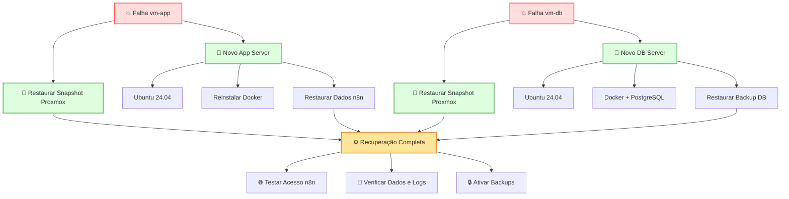

## 📂 Estrutura de backup

- **Banco de dados (vm-db)**: dump diário via `pg_dump`.
- **Dados do n8n (vm-app)**: cópia da pasta `/opt/n8n/data`.
- **Destino dos backups**: `/opt/backups/n8n` na vm-app (pode ser sincronizado depois para outro storage).

---

## 🛠️ Script de backup

Crie o arquivo `/opt/n8n/backup.sh` na **vm-app**:

```bash
#!/bin/bash

# Diretórios
BACKUP_DIR="/opt/backups/n8n"
DATE=$(date +%F_%H-%M)

# Banco de dados
DB_HOST="192.168.100.20"
DB_NAME="n8n"
DB_USER="n8n_user"
DB_PASS="senha_forte_aqui"

# Exportar senha para pg_dump
export PGPASSWORD=$DB_PASS

# Criar diretório se não existir
mkdir -p $BACKUP_DIR

# Backup do banco de dados
pg_dump -U $DB_USER -h $DB_HOST $DB_NAME > $BACKUP_DIR/db_$DATE.sql

# Backup dos dados do n8n
tar -czf $BACKUP_DIR/n8n_data_$DATE.tar.gz /opt/n8n/data

# Remover backups antigos (mantém últimos 7 dias)
find $BACKUP_DIR -type f -mtime +7 -delete
```

Dar permissão de execução:
```bash
chmod +x /opt/n8n/backup.sh
```

---

## ⏰ Automatizar com cron

Edite o cron:
```bash
crontab -e
```

Adicione a linha para rodar todos os dias às 2h da manhã:
```
0 2 * * * /opt/n8n/backup.sh >> /opt/backups/n8n/backup.log 2>&1
```

---

## 🔒 Boas práticas adicionais
- **Criptografar backups** antes de enviar para storage externo.
- **Sincronizar backups** para outro servidor ou NAS.
- Testar restauração periodicamente para garantir que os dumps estão íntegros.

---


## 🔄 Script de restauração

Crie o arquivo `/opt/n8n/restore.sh` na **vm-app**:

```bash
#!/bin/bash

# Diretórios
BACKUP_DIR="/opt/backups/n8n"
LATEST_DB_BACKUP=$(ls -t $BACKUP_DIR/db_*.sql | head -n 1)
LATEST_DATA_BACKUP=$(ls -t $BACKUP_DIR/n8n_data_*.tar.gz | head -n 1)

# Banco de dados
DB_HOST="192.168.100.20"
DB_NAME="n8n"
DB_USER="n8n_user"
DB_PASS="senha_forte_aqui"

export PGPASSWORD=$DB_PASS

echo "Restaurando banco de dados a partir de $LATEST_DB_BACKUP..."
psql -U $DB_USER -h $DB_HOST -d $DB_NAME < $LATEST_DB_BACKUP

echo "Restaurando dados do n8n a partir de $LATEST_DATA_BACKUP..."
rm -rf /opt/n8n/data/*
tar -xzf $LATEST_DATA_BACKUP -C /

echo "Restauração concluída!"
```

Dar permissão de execução:
```bash
chmod +x /opt/n8n/restore.sh
```

---

## 🧪 Teste de restauração

1. **Parar containers**:
   ```bash
   cd /opt/n8n
   docker-compose down
   ```

2. **Rodar restauração**:
   ```bash
   /opt/n8n/restore.sh
   ```

3. **Subir containers novamente**:
   ```bash
   docker-compose up -d
   ```

---

## ⚙️ Boas práticas
- Sempre teste a restauração em ambiente de laboratório antes de precisar em produção.
- Combine com snapshots do **Proxmox** para recuperação rápida de toda VM.
- Considere armazenar backups em storage externo ou **sincronizar com rsync** para maior resiliência.

---

## 📖 Playbook de Desastre – Recuperação do n8n

### 1. Falha da vm-app (servidor de aplicação)
- **Restaurar VM** a partir de snapshot ou backup do Proxmox.
- Caso não haja snapshot:
  1. Criar nova VM com Ubuntu 24.04.
  2. Instalar Docker e Docker Compose.
  3. Restaurar diretório `/opt/n8n/data` a partir do backup (`restore.sh`).
  4. Copiar `docker-compose.yml` e subir containers:
     ```bash
     cd /opt/n8n
     docker-compose up -d
     ```
  5. Restaurar configuração do Nginx e certificados TLS.

---

### 2. Falha da vm-db (servidor de banco de dados)
- **Restaurar VM** a partir de snapshot ou backup.
- Caso não haja snapshot:
  1. Criar nova VM com Ubuntu 24.04.
  2. Instalar Docker e PostgreSQL.
  3. Criar usuário e banco novamente:
     ```sql
     CREATE DATABASE n8n;
     CREATE USER n8n_user WITH PASSWORD 'senha_forte_aqui';
     GRANT ALL PRIVILEGES ON DATABASE n8n TO n8n_user;
     ```
  4. Restaurar dump mais recente:
     ```bash
     psql -U n8n_user -h 192.168.100.20 -d n8n < /opt/backups/n8n/db_YYYY-MM-DD.sql
     ```

---

### 3. Falha total (vm-app + vm-db)
1. Restaurar ambas as VMs a partir de snapshots do Proxmox.
2. Caso não haja snapshots:
   - Criar novamente vm-app e vm-db conforme descrito acima.
   - Restaurar banco de dados primeiro.
   - Depois restaurar dados do n8n.
   - Subir containers e validar conectividade.

---

### 4. Checklist pós-restauração
- **Testar acesso** ao n8n pelo navegador.
- Validar credenciais e workflows.
- Conferir logs de containers:
  ```bash
  docker logs n8n
  ```
- Confirmar que backups automáticos estão ativos (`crontab -l`).

---

### 5. Boas práticas adicionais
- **Snapshots regulares** no Proxmox (diários ou semanais).
- **Backups externos**: sincronizar `/opt/backups/n8n` para NAS ou cloud.
- **Testes de recuperação** trimestrais para garantir integridade.
- Documentar credenciais e chaves em cofre seguro (ex: Vault ou Bitwarden).

---

## Diagrama 

Diagrama visual da arquitetura e fluxo de recuperação que complementa o playbook de desastre. Ele mostra de forma clara os cenários de falha da vm-app e da vm-db, as opções de restauração via snapshot ou reconstrução manual, e como tudo converge para a recuperação completa do ambiente n8n.



https://copilot.microsoft.com/th/id/BCO.5d3d4e6e-7cdf-4cfe-9296-585ff991aa01.png
🧩 Como usar o diagrama junto ao playbook

    Falha vm-app: siga o fluxo superior (snapshot ou reinstalação + restore dos dados).

    Falha vm-db: siga o fluxo inferior (snapshot ou reinstalação + restore do dump).

    Recuperação completa: ambos convergem para a seção central, com checklist de testes e reativação dos backups.

🔒 Próximos passos recomendados

    Documentar credenciais em um gerenciador seguro.

    Automatizar snapshots para reduzir tempo de recuperação.

    Testar restauração trimestral para validar integridade dos backups.
	
---
