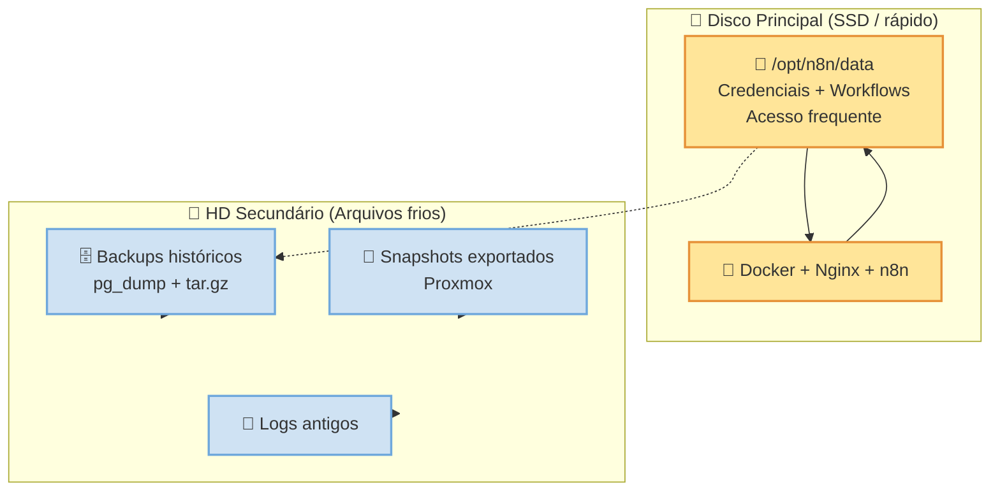

## 🚀 Passo a passo para instalar n8n com Docker

### 1. Preparar ambiente na vm-app
- **Atualizar pacotes**:
  ```bash
  sudo apt update && sudo apt upgrade -y
  ```
- **Instalar Docker e Docker Compose**:
  ```bash
  sudo apt install docker.io docker-compose -y
  sudo systemctl enable docker
  ```

---

### 2. Criar diretórios de persistência
```bash
mkdir -p /opt/n8n/{data,config}
```
- `mkdir -p`: cria todas as pastas intermediárias se não existirem e não retorna erro se já existirem.  
- Estrutura gerada:
  - `/opt/n8n/` (principal)  
  - `/opt/n8n/data/` (dados do n8n: credenciais, SQLite, etc.)  
  - `/opt/n8n/config/` (configurações adicionais)  

---

### 3. Configurar Docker Compose
Arquivo `/opt/n8n/docker-compose.yml`:

```yaml
version: "3.8"

services:
  n8n:
    image: n8nio/n8n:latest
    restart: always
    ports:
      - "5678:5678"
    environment:
      - DB_TYPE=postgresdb
      - DB_POSTGRESDB_HOST=192.168.100.20
      - DB_POSTGRESDB_PORT=5432
      - DB_POSTGRESDB_DATABASE=n8n
      - DB_POSTGRESDB_USER=n8n_user
      - DB_POSTGRESDB_PASSWORD=senha_forte_aqui
      - N8N_ENCRYPTION_KEY=chave_super_secreta
      - N8N_HOST=192.168.0.12
      - N8N_PORT=5678
      - N8N_PROTOCOL=http
      - WEBHOOK_URL=http://192.168.0.12:5678/
    volumes:
      - /opt/n8n/data:/home/node/.n8n
```

- **N8N_HOST=192.168.0.12**: IP externo da vm-app, usado pelo n8n para se identificar internamente.  
- **WEBHOOK_URL=http://192.168.0.12:5678/**: URL pública usada para gerar endpoints de Webhook.  
  → Teste criando um nó Webhook no n8n e verifique se a URL gerada começa com `http://192.168.0.12:5678/`.
- **N8N_ENCRYPTION_KEY**:A variável N8N_ENCRYPTION_KEY define a chave secreta usada pelo n8n para criptografar e descriptografar dados sensíveis armazenados no banco de dados, como credenciais de serviços (chaves de API, senhas, tokens OAuth).

    Proteção de Dados: Garante que informações confidenciais de conexões fiquem protegidas contra acesso direto no banco de dados.

    Persistência entre Reinicializações: Se o container for recriado ou atualizado sem essa variável definida explicitamente, o n8n gerará uma nova chave aleatória a cada inicialização, fazendo com que todas as credenciais salvas anteriormente fiquem inacessíveis e inutilizáveis.

    Como configurar: Deve ser preenchida com uma string aleatória longa e mantida constante. Uma forma comum de gerá-la é executando openssl rand -hex 24 no terminal.
- **volumes: - /opt/n8n/data:/home/node/.n8n**: Essa linha define um mapeamento de volume no Docker, conectando uma pasta do seu servidor (host) a uma pasta interna do container do n8n para garantir que os dados não sejam perdidos.

    /opt/n8n/data (Lado esquerdo): É o caminho no seu servidor (fora do container) onde os arquivos serão armazenados de forma permanente.

    /home/node/.n8n (Lado direito): É o caminho dentro do container onde o n8n nativamente salva seus arquivos essenciais (workflows, credenciais, histórico de execuções e o banco de dados SQLite).
	Por que isso é necessário?
		Os containers Docker são efêmeros por padrão, o que significa que se você atualizar a versão do n8n ou apagar o container, tudo o que estiver dentro dele é destruído. Ao fazer esse mapeamento, o n8n continua salvando seus arquivos diretamente no disco rígido do servidor, permitindo que você reinicie, pare ou atualize o container sem perder nenhum dado.
	
---

### 4. Configurar banco de dados na vm-db
No PostgreSQL:
```sql
CREATE DATABASE n8n;
CREATE USER n8n_user WITH PASSWORD 'senha_forte_aqui';
GRANT ALL PRIVILEGES ON DATABASE n8n TO n8n_user;
```

---

### 5. Subir o container
```bash
cd /opt/n8n
docker compose up -d
```
- `-d` (detached): roda em segundo plano, liberando o terminal.
- O que o docker-compose up faz: Constrói (se necessário), recria, inicia e conecta os containers ao terminal atual, exibindo todos os logs gerados por eles em tempo real.  
- O que o sinalizador -d (ou --detach) faz: Ativa o modo em segundo plano (detached mode). Isso significa que os containers continuam rodando, mas o terminal é liberado imediatamente para que você possa continuar digitando outros comandos.  
---

### 6. Configurar proxy reverso com Nginx
Arquivo `/etc/nginx/sites-available/n8n.conf`:

```nginx
server {
    listen 80;
    server_name n8n.lab.local;

    location / {
        proxy_pass http://localhost:5678;
        proxy_set_header Host $host;
        proxy_set_header X-Real-IP $remote_addr;
        proxy_set_header X-Forwarded-For $proxy_add_x_forwarded_for;
        proxy_set_header X-Forwarded-Proto $scheme;
    }
}
```

Ativar:
```bash
ln -s /etc/nginx/sites-available/n8n.conf /etc/nginx/sites-enabled/
nginx -t && systemctl reload nginx
```

Acesso:  
- **http://192.168.0.12**  
- **http://n8n.lab.local**

---

## 🔒 Boas práticas de segurança
- **Usar HTTPS** com Certbot.  
- Definir **chave de criptografia** forte.  
- Usuário PostgreSQL dedicado com permissões mínimas.  
- Restringir acesso ao banco à rede interna (192.168.100.0/24).  

---

## 💾 Persistência e Backup
- Dados: `/opt/n8n/data`
- Banco: dump via `pg_dump`
- Script de backup diário `/opt/n8n/backup.sh` (mantém últimos 7 dias).
- Script de restauração `/opt/n8n/restore.sh` para recuperar banco e dados rapidamente.
- Agendamento via cron às 2h da manhã:
  ```
  0 2 * * * /opt/n8n/backup.sh >> /opt/backups/n8n/backup.log 2>&1
  ```

---

## 📖 Playbook de Desastre
- **Falha vm-app**: restaurar snapshot ou recriar VM, reinstalar Docker, restaurar `/opt/n8n/data`, subir containers.  
- **Falha vm-db**: restaurar snapshot ou recriar VM, reinstalar PostgreSQL, recriar usuário/banco, restaurar dump.  
- **Falha total**: restaurar ambas as VMs, banco primeiro, depois dados do n8n.  
- **Checklist pós-restauração**: testar acesso, validar workflows, conferir logs, confirmar cron ativo.  

---

👉 Agora o guia está totalmente atualizado com os **novos IPs da vm-app (192.168.0.12 externo e 192.168.100.12 interno)** e mantém todas as explicações detalhadas que você adicionou.  

Quer que eu prepare também um **bloco Mermaid** mostrando o fluxo atualizado de instalação + backup + restauração com os novos IPs para incluir direto no `n8n-documentation.md`?


## Diagrama separação entre disco principal (dados quentes) e HD secundário (backups frios)  

Manter o **`/opt/n8n/data`** no disco principal é a escolha mais equilibrada para garantir **performance e confiabilidade**. Esse diretório é acessado constantemente pelo n8n para credenciais e workflows, então deixar em um HD “não quente” poderia gerar latência ou gargalos desnecessários.  

👉 O HD extra continua sendo útil: você pode usá-lo como **storage de backups históricos** ou para **arquivos frios** (logs antigos, dumps de banco, snapshots exportados). Assim, o disco principal cuida da operação diária e o secundário vira um repositório de longo prazo.

---

### 📊 Estratégia recomendada
- **Manter `/opt/n8n/data`** no disco principal (SSD ou disco rápido).  
- **Usar HD secundário** para:
  - Dumps do PostgreSQL (`pg_dump`).  
  - Arquivos `.tar.gz` dos backups do n8n.  
  - Snapshots exportados do Proxmox.  
- **Automatizar sincronização** entre discos para redundância.  

---

### 🎯 Resultado
- Operação diária do n8n rápida e estável.  
- Backups e arquivos frios guardados em storage separado.  
- Menor risco de gargalo em workflows críticos.  

---



---

### 📊 Interpretação do diagrama
- **Disco Principal (SSD)** → guarda `/opt/n8n/data` e serviços ativos (Docker, Nginx, n8n).  
- **HD Secundário (HDD)** → usado para **backups históricos**, **snapshots exportados** e **logs antigos**.  
- Fluxo tracejado mostra que os dados quentes são copiados para o HD frio apenas para retenção e segurança.

---


devops@vm-app:/opt/n8n$ docker network prune -f
devops@vm-app:/opt/n8n$ sudo systemctl status docker
● docker.service - Docker Application Container Engine
     Loaded: loaded (/usr/lib/systemd/system/docker.service; enabled; preset: enabled)
     Active: active (running) since Sun 2026-09-06 00:26:53 UTC; 7min ago
TriggeredBy: ● docker.socket
       Docs: https://docs.docker.com
   Main PID: 49090 (dockerd)
      Tasks: 10
     Memory: 24.9M (peak: 26.8M)
        CPU: 263ms
     CGroup: /system.slice/docker.service
             └─49090 /usr/bin/dockerd -H fd:// --containerd=/run/containerd/containerd.sock

set 06 00:26:52 vm-app dockerd[49090]: time="2026-09-06T00:26:52.974721662Z" level=info msg="Restoring containers: start."
set 06 00:26:52 vm-app dockerd[49090]: time="2026-09-06T00:26:52.993182237Z" level=info msg="Deleting nftables IPv4 rules" error="ru>
set 06 00:26:53 vm-app dockerd[49090]: time="2026-09-06T00:26:53.004189122Z" level=info msg="Deleting nftables IPv6 rules" error="ru>
set 06 00:26:53 vm-app dockerd[49090]: time="2026-09-06T00:26:53.291712739Z" level=info msg="Loading containers: done."
set 06 00:26:53 vm-app dockerd[49090]: time="2026-09-06T00:26:53.294837615Z" level=info msg="Docker daemon" commit=3ce5872 container>
set 06 00:26:53 vm-app dockerd[49090]: time="2026-09-06T00:26:53.294875936Z" level=info msg="Initializing buildkit"
set 06 00:26:53 vm-app dockerd[49090]: time="2026-09-06T00:26:53.366603066Z" level=info msg="Completed buildkit initialization"
set 06 00:26:53 vm-app dockerd[49090]: time="2026-09-06T00:26:53.370577505Z" level=info msg="Daemon has completed initialization"
set 06 00:26:53 vm-app dockerd[49090]: time="2026-09-06T00:26:53.370671237Z" level=info msg="API listen on /run/docker.sock"
set 06 00:26:53 vm-app systemd[1]: Started docker.service - Docker Application Container Engine.


devops@vm-app:/opt/n8n$ sudo cat /etc/docker/daemon.json
{
  "dns": ["8.8.8.8", "1.1.1.1"],
  "ipv6": false,
  "mtu": 1400
}

devops@vm-app:/opt/n8n$ sudo cat /opt/n8n/docker-compose.yml
services:
  n8n:
    image: n8nio/n8n:latest
    restart: always
    ports:
      - "5678:5678"
    environment:
      - DB_TYPE=postgresdb
      - DB_POSTGRESDB_HOST=192.168.100.20
      - DB_POSTGRESDB_PORT=5432
      - DB_POSTGRESDB_DATABASE=n8n
      - DB_POSTGRESDB_USER=n8nuser
      - DB_POSTGRESDB_PASSWORD=n8nGs      
	  - N8N_ENCRYPTION_KEY=999994fic346e192a1cf3f5cc9db957154c9b7c977848a0d
      - N8N_HOST=192.168.0.12
      - N8N_PORT=5678
      - N8N_PROTOCOL=http
      - WEBHOOK_URL=http://192.168.0.12:5678/
    volumes:
      - /opt/n8n/data:/home/node/.n8n

devops@vm-app:/opt/n8n$ sudo cat /etc/netplan/50-cloud-init.yaml
network:
  version: 2
  renderer: networkd
  ethernets:
    ens18:
      dhcp4: false
      addresses:
        - 192.168.0.12/24
      mtu: 1400
      routes:
        - to: default
          via: 192.168.0.1
      nameservers:
        addresses:
          - 8.8.8.8
          - 1.1.1.1
    ens19:
       dhcp4: false
       addresses:
        - 192.168.100.12/24


devops@vm-app:/opt/n8n$ ip a
1: lo: <LOOPBACK,UP,LOWER_UP> mtu 65536 qdisc noqueue state UNKNOWN group default qlen 1000
    link/loopback 00:00:00:00:00:00 brd 00:00:00:00:00:00
    inet 127.0.0.1/8 scope host lo
       valid_lft forever preferred_lft forever
2: ens18: <BROADCAST,MULTICAST,UP,LOWER_UP> mtu 1400 qdisc fq_codel state UP group default qlen 1000
    link/ether bc:24:11:0a:37:0a brd ff:ff:ff:ff:ff:ff
    altname enp0s18
    inet 192.168.0.12/24 brd 192.168.0.255 scope global ens18
       valid_lft forever preferred_lft forever
    inet6 2804:7af8:239:fc00:be24:11ff:fe0a:370a/64 scope global dynamic mngtmpaddr noprefixroute
       valid_lft 86396sec preferred_lft 86396sec
    inet6 fe80::be24:11ff:fe0a:370a/64 scope link
       valid_lft forever preferred_lft forever
3: ens19: <BROADCAST,MULTICAST,UP,LOWER_UP> mtu 1500 qdisc fq_codel state UP group default qlen 1000
    link/ether bc:24:11:dc:7c:8d brd ff:ff:ff:ff:ff:ff
    altname enp0s19
    inet 192.168.100.12/24 brd 192.168.100.255 scope global ens19
       valid_lft forever preferred_lft forever
    inet6 fe80::be24:11ff:fedc:7c8d/64 scope link
       valid_lft forever preferred_lft forever
4: docker0: <NO-CARRIER,BROADCAST,MULTICAST,UP> mtu 1400 qdisc noqueue state DOWN group default
    link/ether a6:b3:13:f9:ae:a0 brd ff:ff:ff:ff:ff:ff
    inet 172.17.0.1/16 brd 172.17.255.255 scope global docker0
       valid_lft forever preferred_lft forever


devops@vm-app:/opt/n8n$ docker compose up -d
[+] up 1/1
 ✘ Image n8nio/n8n:latest Error failed to resolve reference "docker.io/n8nio/n8n:latest": failed to do request: Head "https:... 51.2s
Error response from daemon: failed to resolve reference "docker.io/n8nio/n8n:latest": failed to do request: Head "https://registry-1.docker.io/v2/n8nio/n8n/manifests/latest": net/http: TLS handshake timeout

devops@vm-app:/opt/n8n$ curl -I https://registry-1.docker.io/v2/
curl: (35) Recv failure: Connection reset by peer
