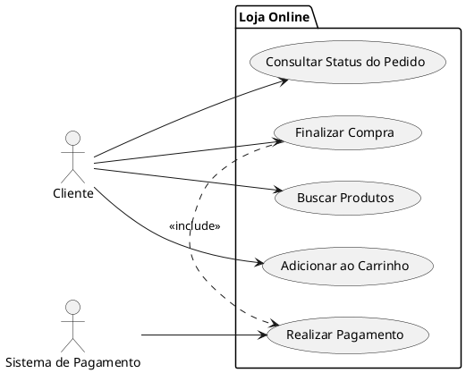

# Caso de Uso com UML

Este documento explica de forma completa e detalhada o que são Casos de Uso (Use Cases) em UML, como modelá-los, quais são seus elementos principais, boas práticas e exemplos práticos — incluindo um diagrama em PlantUML que você pode renderizar localmente.

Sumário
- Introdução
- O que é um Caso de Uso
- Elementos principais
- Relacionamentos em diagramas de caso de uso
- Especificação de um Caso de Uso (template)
- Exemplo prático (Compra de Produto) com PlantUML
- Boas práticas e dicas
- Ferramentas e comandos úteis
- Checklist de revisão

## Introdução

Os Casos de Uso são uma técnica de modelagem usada para capturar requisitos funcionais de um sistema do ponto de vista de seus usuários (atores). Em UML (Unified Modeling Language), os Casos de Uso são frequentemente representados por diagramas que mostram atores, casos de uso e os relacionamentos entre eles. Eles ajudam a comunicar o comportamento esperado do sistema e servem como ponte entre analistas, stakeholders e equipe técnica.

## O que é um Caso de Uso

Um Caso de Uso descreve um conjunto de interações entre um ator (usuário ou outro sistema) e o sistema em busca de um objetivo específico. Cada Caso de Uso foca em uma funcionalidade observável que oferece valor a um ator.

Características importantes:
- Orientado a objetivo: descreve o "porquê" e o "o quê", não o "como".
- Visão externa: descreve o comportamento do sistema visto de fora.
- Granularidade: pode variar de alto nível (ex.: "Gerenciar Pedidos") a baixo nível (ex.: "Adicionar Item ao Pedido").

## Elementos principais

- Ator: entidade externa que interage com o sistema (usuário humano, outro sistema, hardware). Representado por um boneco (stickman).
- Caso de Uso: funcionalidade ou serviço disponibilizado pelo sistema. Representado por uma elipse.
- Sistema (Boundary): caixa que delimita o escopo do sistema modelado. Tudo dentro da caixa são casos de uso do sistema.
- Associação: linha que liga ator a caso de uso (indica interação).

## Relacionamentos em diagramas de caso de uso

- Associação (Association): vínculo entre ator e caso de uso — indica que o ator participa do caso de uso.
- Include (<<include>>): indicação de que um Caso de Uso inclui o comportamento de outro Caso de Uso obrigatório e reutilizável (como uma chamada de função). Usado para evitar repetição de fluxos comuns.
- Extend (<<extend>>): extensão condicional de um Caso de Uso principal — define comportamento opcional que ocorre sob condições específicas.
- Generalização (Herança): aplica-se tanto a atores quanto a casos de uso; permite especializar atores ou casos de uso.

Observação sobre uso de <<include>> e <<extend>>:
- Use <<include>> quando quiser extrair um fluxo comum (obrigatório) em um caso de uso separado.
- Use <<extend>> para condicionar um fluxo que só ocorre em certas circunstâncias (opcional).

## Especificação de um Caso de Uso (template)

Para documentar um Caso de Uso de maneira que ele seja útil para análise e implementação, use um template com os seguintes campos:

- ID: identificador único.
- Nome: título curto e descritivo (ver regras de nomenclatura abaixo).
- Ator(es): participantes primários e secundários.
- Objetivo (goal): objetivo que o ator quer alcançar.
- Prioridade: alta/média/baixa.
- Pré-condições: o que precisa ser verdade antes de iniciar.
- Pós-condições (Garantias): estado do sistema após a conclusão (sucesso/fracasso).
- Fluxo principal (Basic Flow): sequência passo a passo do cenário mais comum.
- Fluxos alternativos (Alternative Flows): variações e exceções do fluxo principal, com referências aos passos correspondentes.
- Regras de negócio relevantes: políticas ou restrições aplicáveis.
- Exceções e erros: tratamentos esperados para falhas.
- Frequência esperada / Métricas: se relevante.
- Observações / Notas: links para requisitos, histórias, protótipos.

Nomenclatura recomendada para o campo Nome: verbo no infinitivo + objeto, por exemplo: "Registrar Pedido", "Emitir Nota Fiscal", "Consultar Saldo".

## Exemplo prático: Compra de Produto (resumo + diagrama PlantUML)

Descrição resumida: O cliente seleciona produtos, adiciona ao carrinho, finaliza a compra e realiza o pagamento. O sistema confirma o pedido e notifica o cliente.

Casos de Uso principais:
- Buscar Produtos
- Adicionar Produto ao Carrinho
- Finalizar Compra
- Realizar Pagamento
- Consultar Status do Pedido

Ator principal: Cliente
Ator secundário: Sistema de Pagamento (externo)

Abaixo um diagrama de exemplo em PlantUML que representa esses elementos. Salve o trecho abaixo num arquivo com extensão `.puml` (por exemplo, `compra-produto.puml`) e renderize com PlantUML.



Explicação do diagrama:
- O ator Cliente realiza buscas, adiciona itens, finaliza compra e consulta status.
- O Caso de Uso "Finalizar Compra" inclui obrigatoriamente "Realizar Pagamento" (comunicação com ator "Sistema de Pagamento").

## Modelo de Especificação (exemplo) — Caso de Uso: Finalizar Compra

- ID: CU-002
- Nome: Finalizar Compra
- Ator(es): Cliente, Sistema de Pagamento
- Objetivo: Permitir que o cliente conclua a compra de itens no carrinho.
- Pré-condições: Carrinho com pelo menos um item; cliente autenticado (se aplicação exigir).
- Pós-condições: Pedido criado no sistema; pagamento processado (ou transação pendente/inválida).
- Fluxo Principal:
  1. Cliente visualiza o carrinho.
  2. Cliente escolhe endereço e forma de pagamento.
  3. Cliente confirma a compra.
  4. Sistema encaminha pedido ao Sistema de Pagamento.
  5. Pagamento aprovado: sistema cria pedido e envia confirmação ao cliente.
- Fluxos Alternativos:
  - 4a. Pagamento recusado: sistema informa o cliente e oferece alternativas (tentar outro cartão, cancelar).
  - 2a. Endereço inválido: solicita correção.
- Regras de negócio:
  - Aplicar cupom somente se válido e na validade.
  - Não permitir finalização se estoque insuficiente.
- Observações: Integrar com serviço de antifraude quando o valor for acima de X.

## Boas práticas e dicas

- Mantenha os casos de uso focados em objetivos do ator; não descreva design técnico.
- Evite casos de uso muito grandes — prefira decompor em subcasos de uso quando necessário.
- Use <<include>> para extrair passos comuns (por exemplo, autenticação) e <<extend>> para comportamentos opcionais (por exemplo, "Aplicar Cupom" que só ocorre se o cliente optar).
- Nomeie casos de uso com verbo + objeto.
- Relacione cada Caso de Uso a requisitos funcionais (rastreamento) e mantenha essa ligação atualizada.
- Inclua pré e pós-condições sempre que possível — ajudam a definir contratos e critérios de aceitação.
- Documente fluxos alternativos e exceções; são cruciais para testes e implementação.

## Ferramentas e comandos úteis

Ferramentas populares para diagramas de Caso de Uso:
- PlantUML (texto -> diagrama)
- draw.io / diagrams.net
- Visual Paradigm
- Sparx Enterprise Architect
- StarUML

Renderizando PlantUML no Windows PowerShell (exemplo):

1) Instale o PlantUML (baixar plantuml.jar) e Graphviz (necessário para PNG/SVG). Coloque `plantuml.jar` em uma pasta conhecida.

2) Salve o exemplo em `compra-produto.puml` e execute no PowerShell:

```powershell
java -jar C:\caminho\para\plantuml.jar -tpng .\compra-produto.puml
```

Isso gerará `compra-produto.png` no mesmo diretório.

Se você usa VS Code, instale a extensão PlantUML para pré-visualização instantânea.

## Checklist para revisar um Diagrama de Caso de Uso

- [ ] Atores identificados corretamente (primários e secundários).
- [ ] Casos de Uso descritos com objetivo claro.
- [ ] Relações <<include>> e <<extend>> usadas apropriadamente (não abusar).
- [ ] Pré e pós-condições documentadas para casos críticos.
- [ ] Fluxos alternativos e exceções cobertos.
- [ ] Rastreabilidade entre casos de uso e requisitos/user stories.
- [ ] Nomeclatura consistente (Verbo + Objeto).

## Referências rápidas

- UML 2.x Specification (OMG)
- PlantUML: https://plantuml.com/pt/
- "Writing Effective Use Cases" — Alistair Cockburn (livro recomendado)

---

Arquivo criado: `docs/reference/caso-de-uso-uml.md`

