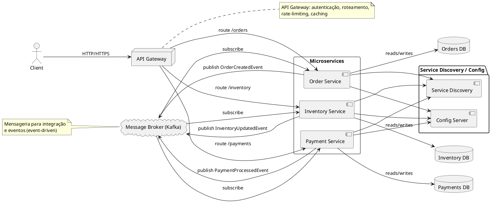

# Microsserviços

Este documento apresenta uma explicação completa e detalhada sobre Microsserviços (Microservices), cobrindo definição, características, arquitetura, padrões e práticas recomendadas para projetar, desenvolver, testar, implantar e operar sistemas baseados em microsserviços — com foco em aplicações Java, considerando que todo o desenvolvimento nesta IDE será nesse contexto.

Sumário
- O que é Microsserviço
- Características principais
- Arquitetura e componentes comuns
- Comunicação entre serviços
- Gestão de dados e consistência
- Padrões e estratégias importantes
- Observabilidade e operação
- Testes e qualidade
- Segurança
- Deploy, containers e orquestração
- CI/CD
- Quando usar (e quando evitar)
- Checklist de adoção

## O que é Microsserviço

Microsserviços são uma abordagem arquitetural para construir sistemas como um conjunto de pequenos serviços independentes, cada um executando um único propósito de negócio e comunicando-se por APIs bem definidas. Cada microsserviço é desenvolvido, implantado e escalado de forma independente, frequentemente por equipes pequenas e multifuncionais.

## Características principais

- Tamanho e escopo reduzidos: cada serviço implementa uma única responsabilidade de negócio (Single Responsibility Principle no nível de serviço).
- Independência de implantação: serviços podem ser lançados, atualizados e escalados sem afetar todo o sistema.
- Tecnologias heterogêneas: cada serviço pode usar tecnologia, linguagem e banco de dados mais adequados (polyglot persistence e polyglot programming), embora em um time Java costumaremos padronizar em Java.
- Isolamento de falhas: falhas em um serviço tendem a não derrubar a aplicação inteira se mitigadas adequadamente (circuit breakers, timeouts).
- Organização por domínio: geralmente mapeados a contextos delimitados (Bounded Contexts) do Domain-Driven Design (DDD).

## Arquitetura e componentes comuns

- API Gateway: ponto de entrada único para clientes (agrega, roteia, autentica, aplica rate-limiting, caching).
- Service Discovery: registro e descoberta dinâmica de instâncias (Eureka, Consul, Kubernetes DNS).
- Config Server: centraliza configurações (Spring Cloud Config, Vault para segredos).
- Message Broker: comunicação assíncrona (Kafka, RabbitMQ) para eventos e integração.
- Circuit Breaker / Bulkhead / Retry: padrões de resiliência (Hystrix era popular; hoje Resilience4j é comum).
- Observability Stack: logs centralizados (ELK/EFK), métricas (Prometheus + Grafana), tracing distribuído (Jaeger, Zipkin).

## Comunicação entre serviços

Comunicação pode ser síncrona ou assíncrona — escolher de acordo com requisitos:

- Síncrona (HTTP/REST, gRPC): simples e direta; adequado quando a resposta imediata é necessária. Em Java use Spring Web (REST), Spring WebFlux para reatividade, ou gRPC para performance binária.
- Assíncrona (mensageria/event-driven): desacopla serviços, melhora resiliência e escalabilidade. Use Kafka para eventos em larga escala ou RabbitMQ para mensagens orientadas a fila/rotas.

Padrões importantes:
- Request/Response (síncrono)
- Publish/Subscribe (eventos)
- Command Bus / Event Bus
- Saga Pattern (orquestrado ou coreografado) para garantir consistência entre serviços sem transações distribuídas.

## Gestão de dados e consistência

- Banco por serviço: cada microsserviço deve possuir seu próprio esquema/instância de persistência para garantir acoplamento fraco.
- Consistência eventual: preferida em arquiteturas distribuídas; use compensações, eventos e Sagas para declarar e gerenciar estados intermediários.
- Transações distribuídas (Two-phase commit) são geralmente evitadas por complexidade e custo; prefira Sagas e CQRS quando necessário.

## Padrões e estratégias importantes

- API Gateway: agregação, autenticação, limite de taxa, transformação de protocolos.
- Service Discovery: registro (server) e clientes que consultam o registro para localizar instâncias.
- Circuit Breaker / Retry / Timeout: protegem contra chamadas lentas ou falhas.
- Bulkhead: isola recursos (threads, conexões) entre serviços para evitar contaminação.
- Backpressure e Rate Limiting: controlar entrada de requisições para proteger serviços.
- CQRS + Event Sourcing: separar leitura e escrita; armazenar eventos para reconstruir estado se o domínio justificar.
- Saga Pattern:
  - Orquestrado: um coordenador central dirige a saga.
  - Coreografado: cada serviço emite eventos e reage sem um coordenador central.

## Observabilidade e operação

- Logs estruturados e centralizados (JSON) com correlação de requestId/traceId. Ferramentas: ELK/EFK (Elasticsearch, Logstash/Fluentd, Kibana), Loki.
- Métricas: instrumente serviços (Micrometer em Java) e exponha via Prometheus.
- Tracing distribuído: propague traceId/spanId entre serviços (Sleuth + Zipkin/Jaeger ou OpenTelemetry).
- Health checks e readiness/liveness probes (Kubernetes).

## Testes e qualidade

- Testes unitários: cada serviço deve ter cobertura de unidade com Mockito/JUnit.
- Testes de contrato (Consumer-Driven Contract): pact ou Spring Cloud Contract para garantir compatibilidade entre consumidores e provedores.
- Testes de integração: spin-up de dependências (containers com Testcontainers) e testes end-to-end em ambientes controlados.
- Testes de contrato/integração de mensagens: validar eventos produzidos/consumidos.
- Testes de carga e stress: avaliar escalabilidade e pontos de contenção.

## Segurança

- Autenticação e Autorização centralizada (OAuth2/OpenID Connect, Keycloak, Auth0).
- Segurança nas comunicações: TLS mTLS entre serviços (especialmente em malha de serviço/Service Mesh).
- Princípio do menor privilégio e segregação de dados.
- Rotação de segredos e uso de vaults (HashiCorp Vault, AWS Secrets Manager).

## Deploy, containers e orquestração

- Containerização: crie imagens leves e imutáveis (OpenJDK+JRE, GraalVM/Native quando relevante). Use multi-stage builds para reduzir tamanho.
- Orquestração: Kubernetes é a escolha dominante — use Deployments, Services, Ingress, ConfigMaps e Secrets.
- Service Mesh (Istio, Linkerd): oferece roteamento avançado, observabilidade e segurança sem alterar código.

## CI/CD

- Pipelines automáticos por serviço (build, test unitário, análise estática, build de imagem, publicação para registry, deploy em staging/produção).
- Estratégias de deploy: blue/green, canary, rolling updates.

## Quando usar (e quando evitar)

Use microsserviços quando:
- Domínio grande, com equipes independentes e necessidade de escalar partes diferentes da aplicação.
- Requisitos de disponibilidade e times que podem operar serviços independentes.

Evite microsserviços quando:
- Aplicação pequena ou equipe reduzida — a complexidade operacional pode superar os benefícios.
- Não há necessidade de escalar independentemente ou a sobrecarga operacional não é justificável.

## Checklist de adoção

- [ ] Mapear bounded contexts e definir serviços iniciais.
- [ ] Definir contratos (APIs/Events) e versionamento.
- [ ] Padronizar formatos de logs, traceId e métricas (Micrometer/OpenTelemetry).
- [ ] Escolher infra: container registry, orquestrador (K8s), message broker.
- [ ] Implementar monitoração e alertas (SLO/SLI/Alertas).
- [ ] Pipeline CI/CD por serviço com deploy automatizado.
- [ ] Plano de rollbacks e estratégia de deploy (canary/blue-green).
- [ ] Estratégia de testes: unit, contract, integration, e2e.
- [ ] Segurança: autenticação centralizada, TLS, gerenciamento de segredos.

---

Exemplo simples (padrão HTTP + eventos) — visão conceitual em pseudo-código Java:

```java
// Serviço de Pedido (OrderService) - expõe REST e publica evento
@RestController
public class OrderController {
	@PostMapping("/orders")
	public ResponseEntity<OrderDto> create(@RequestBody CreateOrderCmd cmd) {
		OrderDto order = orderService.create(cmd);
		eventPublisher.publish(new OrderCreatedEvent(order.getId(), order.getTotal()));
		return ResponseEntity.status(HttpStatus.CREATED).body(order);
	}
}

// Serviço de Pagamento - consome evento ou chama endpoint
@Component
public class PaymentHandler {
	@EventListener
	public void onOrderCreated(OrderCreatedEvent e) {
		paymentService.process(e.getOrderId(), e.getAmount());
	}
}
```

## Diagrama arquitetural (PlantUML)

Abaixo está um diagrama PlantUML que ilustra uma arquitetura típica de microsserviços com API Gateway, serviços (Order, Payment, Inventory), message broker, bancos de dados por serviço, e Service Discovery/Config. Salve o conteúdo em `docs/diagrams/microsservico-arquitetura.puml` e renderize com PlantUML (instruções logo abaixo).



Renderizando o diagrama (PowerShell):

```powershell
# Coloque plantuml.jar em C:\tools\plantuml\plantuml.jar (exemplo)
# Gere PNG:
java -jar C:\tools\plantuml\plantuml.jar -tpng .\docs\diagrams\microsservico-arquitetura.puml

# Gere SVG:
java -jar C:\tools\plantuml\plantuml.jar -tsvg .\docs\diagrams\microsservico-arquitetura.puml
```

Após gerar a imagem (PNG/SVG), você pode inserir no Markdown usando:

```markdown

```

Observação final

Microsserviços aumentam a flexibilidade e escalabilidade, mas também introduzem complexidade operacional e de engenharia. Planeje incrementalmente: comece modularizando o monolito por domínios, invista em automação, observabilidade e cultura DevOps antes de multiplicar serviços.

